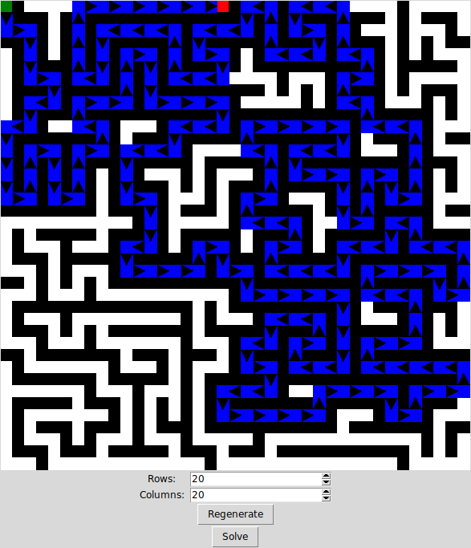

# Maze Generator #

This is a Python script that uses [randomized DFS](https://en.wikipedia.org/wiki/Maze_generation_algorithm#Depth-first_search) to generate a maze. Tkinter is used to display the generated maze and its solution. By default, the green square is the start of the maze, and the red square is the end.

## Dependencies ##

* Python 2
* Tkinter

## Run ##

    python maze.py
